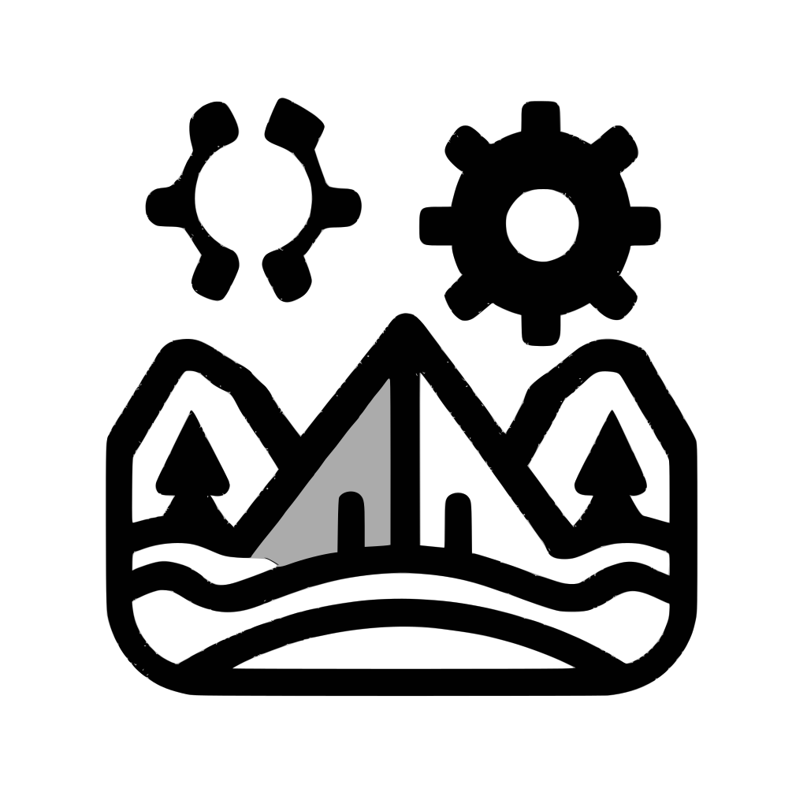
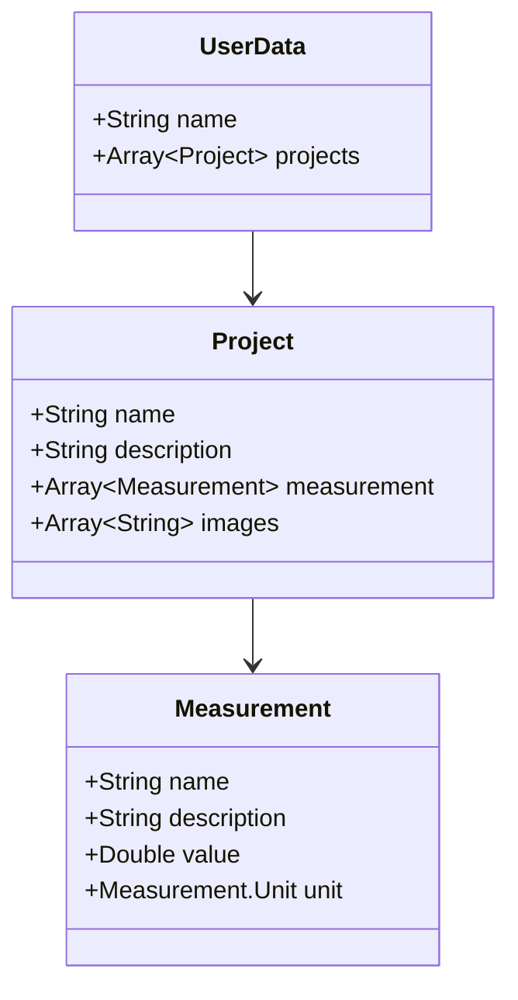

# youkon
YouKon is a multiplatform mobile app used for unit conversions and projects for scientists engineers.
It allows you to group several related parameters, and convert each to a consistent unit system, regardless of the what each system each was originally defined for.
Examples where this may be useful:
- Mass properties and dimensions of an aerospace vehicle
- Density, elastic, and strength properties of a material
- Measurement quantities for a recipe
- ... and many more

## User Interface

## Shared Architecture

Kotlin Multiplatform Mobile is used to provide a set of shared data models.
The lowest level object is a `Measurement`, which stores the numeric `value` and its `unit`, along with methods for conversion.
A `Project` is a collection of `Measurement`s, and may include images.
A saved set of `Project` objects that an individual user has generated is stored in the `UserData` object.

