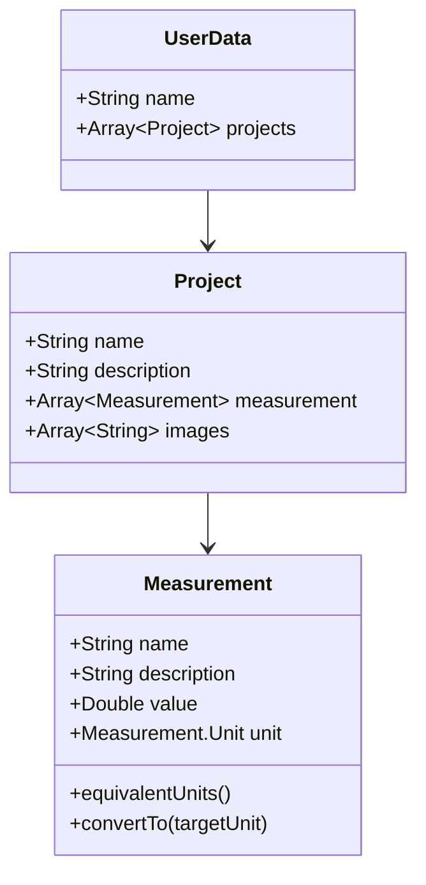

# 

YouKon is a multiplatform mobile app used for unit conversions and projects for scientists and engineers.
It allows you to group several related parameters, and convert each to a consistent unit system, regardless of the what each system each was originally defined for.
Examples where this may be useful:
- Mass properties and dimensions of an aerospace vehicle
- Density, elastic, and strength properties of a material
- Measurement quantities for a recipe
- ... and many more

## User Interface

The main application view includes the logo and header, a quick conversion card, and the projects card
Quick conversion includes a text field for entering numeric values, and dropdowns for selecting "from" and "to" units.
Each user has a projects card, where any single project represents a grouping of measurement data that hold a common purpose.
The projects in the card are laid out as tiles, which can be tapped to expand and show the enclosed measurements. 
With a project file expanded, the user may then modify the measurements of that particular project.
Unlike the quick converter, the individual measurements in a project do not have a "to" unit selector, rather the entire project will have a selector for a consistent unit set (i.e. Imperial or SI), and all measurements will get converted to this unit set.

## Shared Architecture

Kotlin Multiplatform Mobile is used to provide a set of shared data models.
The lowest level object is a `Measurement`, which stores the numeric `value` and its `unit`, along with methods for conversion.
A `Project` is a collection of `Measurement`s, and may include images.
A saved set of `Project` objects that an individual user has generated is stored in the `UserData` object.

